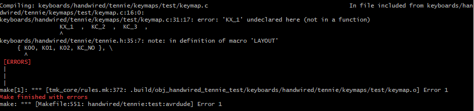

# Compiling

To compile your firmware, you run a similar command to how we tested our environment.
`make handwired/tennie:<folder-name>:avrdude` where "folder-name" is what you named the folder you made earlier!

Ideally it will work the same way and will end with you pressing the reset switch through the case. You may however encounter an error. If you do, it will look something like this...

In this example, KC_1 is misspelled. If you do get an error, just try your best to work through it. If you can't figure it out, grab someone who is assisting with the workshop.

If it succeeds, test your macropad. Make sure all the keys do what you think they should. If not, try to correct them in your code. If they do, you're done! Congratulations on completing the Macropad Workshop!

If you wanted to continue or explore more... [look at this](end.md)
