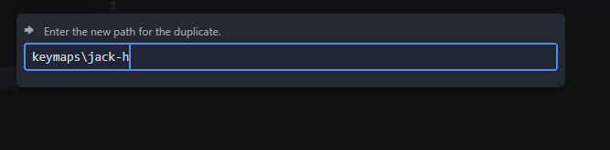

# Multi-layer

Multi-layered set ups are a bit more difficult but much more fun to program and allow for much more keys to be mapped! I'm going to assume you feel at least a little comfortable with C or C++ and are willing to dig in a bit more to the QMK documentation.

 To make a multi-layered keymap lets start by copying a template. The `default` keymap should be used. Copy the folder and rename it to your name or online moniker.




You'll notice there are 3 files in this folder. We'll start by modifying the `keymap.c` file. Open your file, and turn your attention to the `KEYMAP()` functions, and the macros above it.

I'll start by explaining the example.
```
// Layer names
#define base  0
#define shrek 1
#define ogre  2
#define tcp   3

// Layer Switches
#define KC_SHRK TT(shrek)
#define KC_OGRE TT(ogre)
#define KC_TCP TT(tcp)
```

Each layer is a 2 dimensional array, in another array. We can work with just indexes from 0 to 31 for that 3rd array of keymaps, but it's much easier to remember both the functionality and to deal with if you give each index a name. Remember when laying these out that the firmware will seek the keycode from highest layer to lowest. If you wanted to use a key from one layer, it should be beneath the layers you want it on!

The second part there with `#define KC_SHRK TT(shrek)` are layer switch keycode macros. There are a few different functions you could use that would toggle layers in different ways. Those can be found [here in the layers section.](https://docs.qmk.fm/#/feature_advanced_keycodes) The KC_* is just a nice shorthand for the keymaps to be more readable when it's put in the layout. I recommend reading the whole section, and [the basic keycodes section](https://docs.qmk.fm/#/keycodes_basic) before moving on.

After that, you have the 3d array of keycodes.

Each layer looks something like this:
```
[base] = LAYOUT(
//         ┌────────┬────────┬────────┐

              KC_X  ,  KC_X  ,  KC_X  ,

//    ├────────┼────────┼────────┼────────┼

         KC_X  ,  KC_X  ,  KC_X  ,  KC_X  ,

//    ├────────┼────────┼────────┼────────┼

              KC_X  ,  KC_X  ,  KC_X

//         └────────┴────────┴────────┘
),
```

You would replace KC_X with whatever basic or advanced keycode you would desire. You would use transparent keys in a layer to allow the lower layer to bleed through. You can also have a KC_NO or KC_XXXX to block out a key from being read on a layer. When making your layers, keep in mind.

For all advanced keycodes, I recommend a macro like the layer macros to keep the `LAYOUT`s clean looking. I also recommend the shorter no-more-than-4 names for keycodes, and macros.

Good luck! If you want any help come grab me (Jack Hildebrandt), I'm always happy to help!

[After you get everything squared away, you should move on to compiling.](compiling.md)
