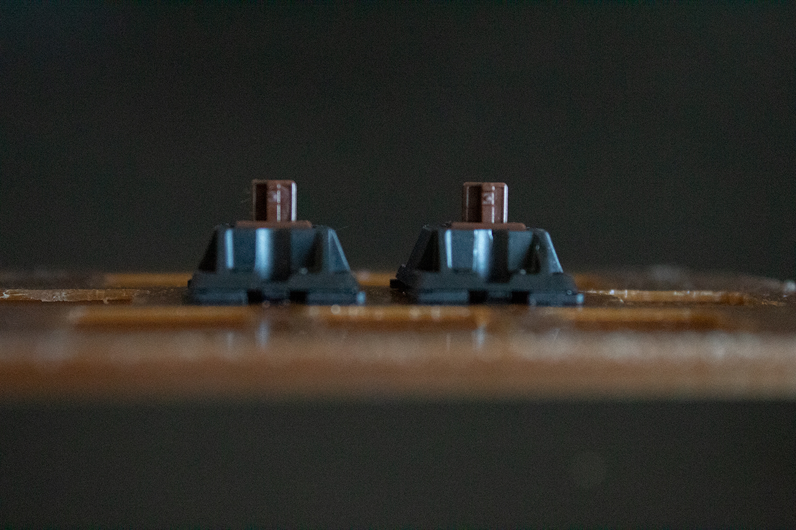
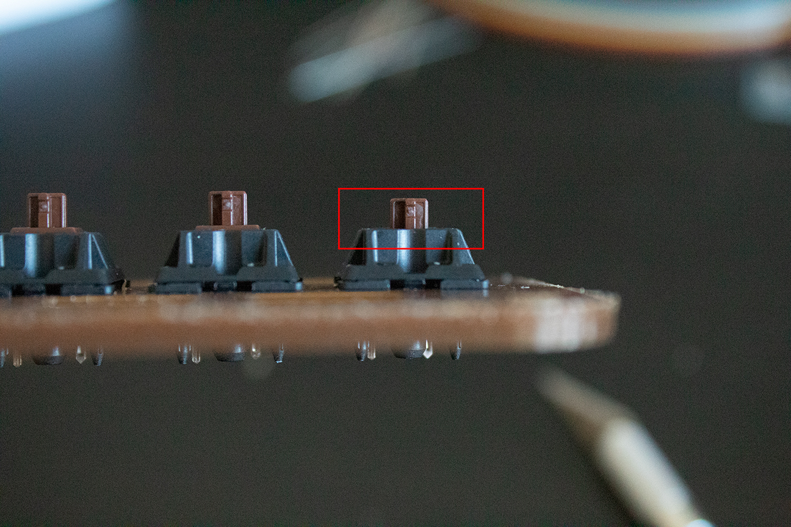
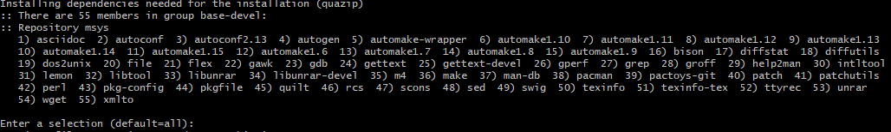
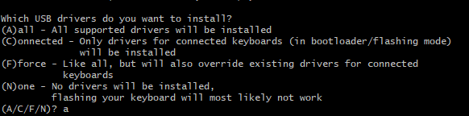

# Prep

## The casing

Before we start on anything else we should start with the casing. Starting by tackling the plate and getting the switches installed. Popping the switches in is easy and shouldn’t take you too long. Just make sure they all face the same direction.

The plate we’re putting the switches on is 3d printed, so if when you put the switches in they look like the switches do below you will need to clean the hole out. We have sandpaper and x-acto knives for this purpose.

## The compile environment

First you need a text editor. I recommend [atom](https://atom.io/) and my examples in the workshop will use it and all directions will assume you are. Augment the directions for your preferred text editor if you would like to use something else.

Setting up the build environment differs based on what system you're on. Following the guide [here](https://docs.qmk.fm/#/newbs_getting_started) can get you all set up. You should download the x86_64 version.
We'll walk through what the guide says for **Windows** below with screenshots.

If you are on another system, this will be slightly easier.

***Note:*** If you have the windows subsystem you *could* follow the Linux instructions from the bash terminal. You will have to manually flash your board though and I ***HIGHLY*** recommend you don't. Using avrdude is out of the scope of this workshop.

#### Windows:

To start, download msys2. That can be found [here](http://www.msys2.org/). You want to click the middle download button (for x86_64).
Allow it to install and open it (just leave the last box checked).
Once it opens paste this command in:

`sh -c "$(curl -fsSL https://raw.githubusercontent.com/StoutIEEE/macropad-workshop/master/setup-qmk.sh)"`

It will ask you to say yes a lot. Just type `y` in response. If it **doesn't** ask you a yes or no question, use your best judgement. We want whatever the default option is or the "all" option for simplicity. A few examples are shown below.

At one point it will ask you for administrative privileges, just say yes. *I promise nothing bad will happen.* It needs to install drivers for the AVR and ARM microprocessors.

Once the whole process finishes, close the window and relaunch msys2. This script will prompt you.

Enter this command to get into the source code folder: `cd ~/qmk_firmware/`

We're done setting up our built environment. [***Now it's time for the real magic.***](soldering.md)

#### Linux and Mac:

**Note**: Only Debian, Ubuntu, Fedora, and Arch are supported Linux distros. The script will probably still work if you have git installed and are on another distro.

Open your terminal. For macs this will be in your app launcher or in your apps folder under utils. You could also search for terminal with `CMD+Spacebar`

Paste in this command: `sh -c "$(curl -fsSL https://raw.githubusercontent.com/StoutIEEE/macropad-workshop/master/setup-qmk.sh)"`

This process will vary GREATLY between distros and between Mac and Linux systems. Try to use your best judgment and go with defaults for everything you can.

Once the whole process finishes, close the window and relaunch your terminal. This script will prompt you.

Enter this command to get into the source code folder: `cd ~/qmk_firmware/`

We're done setting up our built environment. [***Now it's time for the real magic.***](soldering.md)
