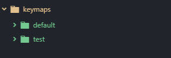

# Programing

Now that you have a working keyboard, you can customize it to make it work the way you want. We'll be around to help you, but it's your keyboard so it's impossible to write up a guide for what you'd want! We can however write a guide for the process.

To start open a text editor. Again, I recommend [atom](https://atom.io/) and my example will use it and all directions will assume you are. Augment the directions for your preferred text editor.

To start, open your text editor. If you just installed atom, you will have a few welcome files to close. Open the folder qmk folder. That will be:
+ `C:\msys2\home\<username>\qmk_firmware\keyboards\handwired\tennie\keymaps\` for Windows with msys2
+ `/Users/<username>/qmk_firmware/keyboards/handwired/tennie/keymaps/` on Mac
+ `/home/<username>/qmk_firmware/keyboards/handwired/tennie/keymaps/` on Linux

In atom this can be done through `File > Add Project Folder...` and navigating to that folder.

You should have a dropdown with folders on the left hand of your screen containing these two folders.

At this point you have a decision. **You must choose if you want a single layer or multiple layers.** Having multiple layers will allow you to have more keys bound to a single key and will have more functionality but will be more complicated to set up and remember. I ***strongly*** recommend going with the single layer unless you feel comfortable with C or C++ and are willing to get into the documentation weeds and figure some things out.

+ [Directions for single layer](single-layer.md)
+ [Directions for multiple layers](multi-layer.md)
