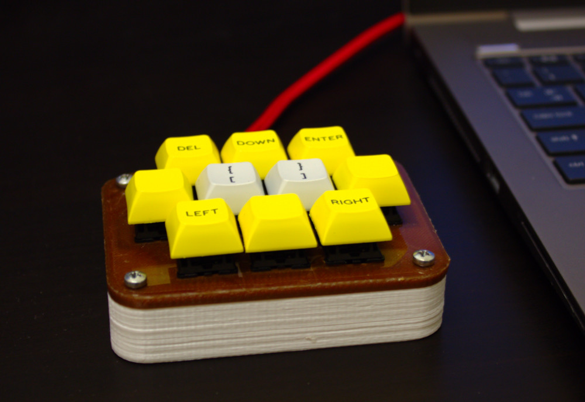

# Macropad workshop

This is the repo for everything related to the IEEE macropad workshop (aside from the firmware, and keymaps which can be found in the [QMK firmware repo]())

A BOM, the circuit, and casing files can be found here as well as instructions to build.

## Instructions

1. [Start](start.md)
2. [Prep](prep.md)
3. [soldering](soldering.md)
4. [Testing and build wrap up](test-wrapup.md)
5. [Programming](programming.md)
  * [Single layer](single-layer.md)
  * [Multi layer](multi-layer.nd)
  * [Compiling](compiling.md)
6. [End](end.md)

## Special thanks to...

##### Professor Steven Heidtke
 + Helping us CNC mill our base parts
 + Spending ***a lot of time*** with us to get the milling code working

##### Fryklund Lab 101
 + Providing us a big scary CNC machine to make parts with

##### Melissa @ PimpMyKeyboard
 + Helping us get our keycaps in order

##### Will @ SwitchTOP
 + Helping us get our keyswitches in order

##### IEEE Twin Cities
 + Helping us out with funding for the workshop

##### Stout Student Association
 + Helping us out with funding for the workshop
 + Putting up with our shenanigan
