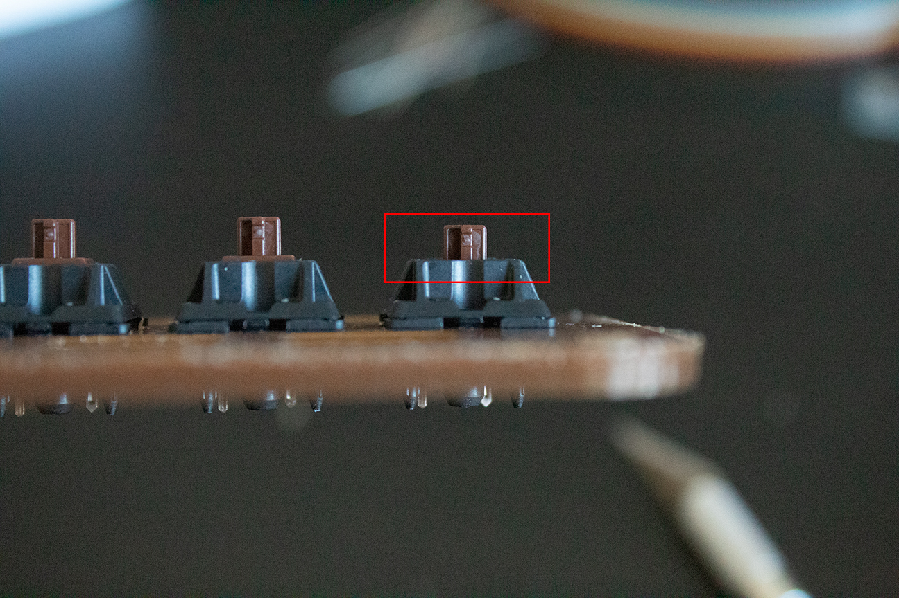
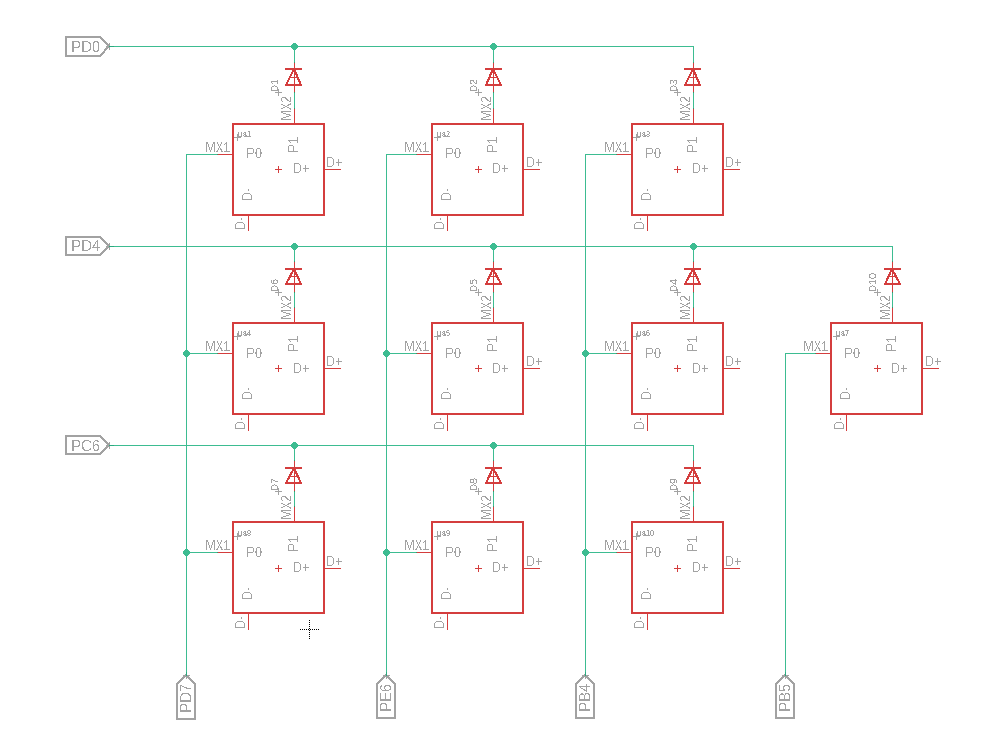
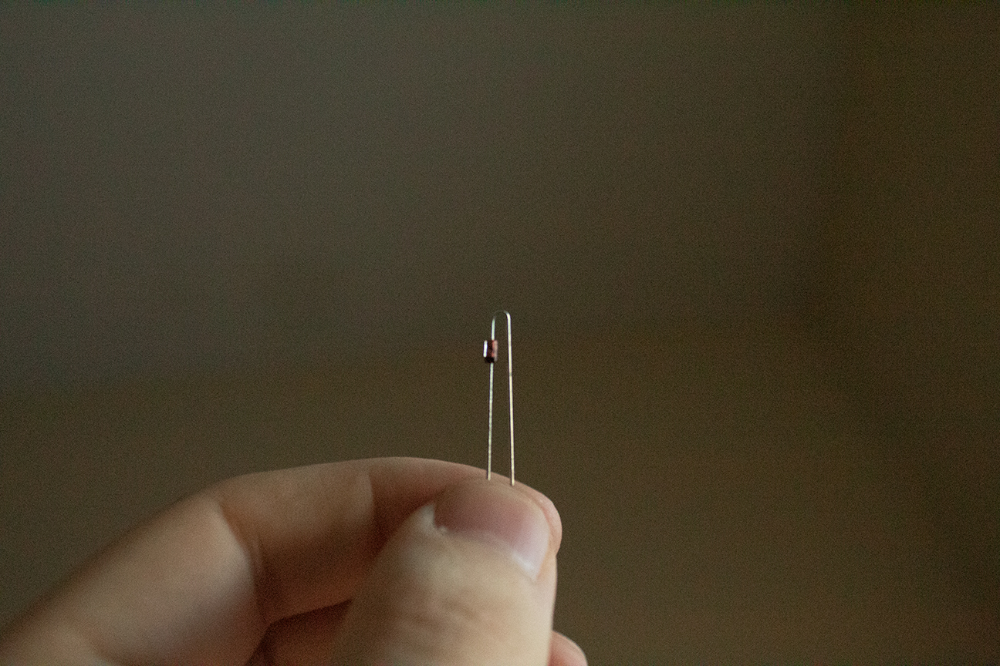
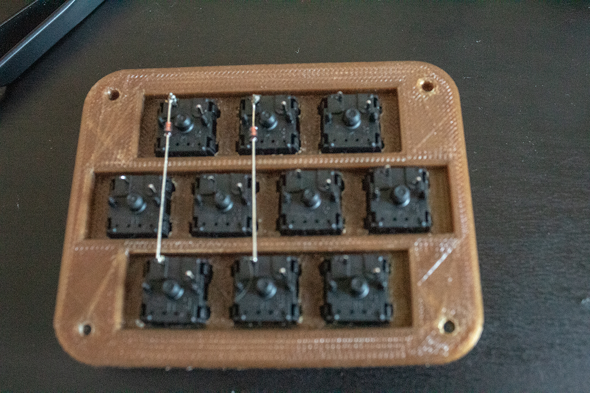
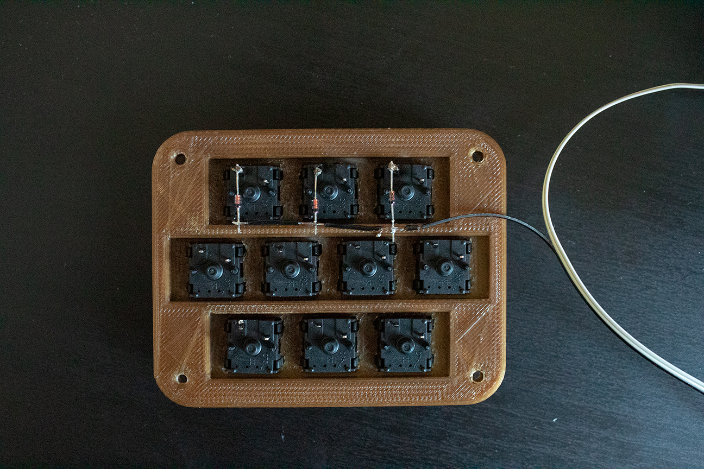
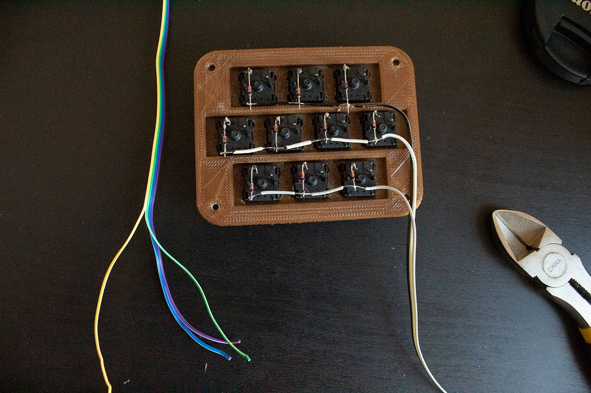
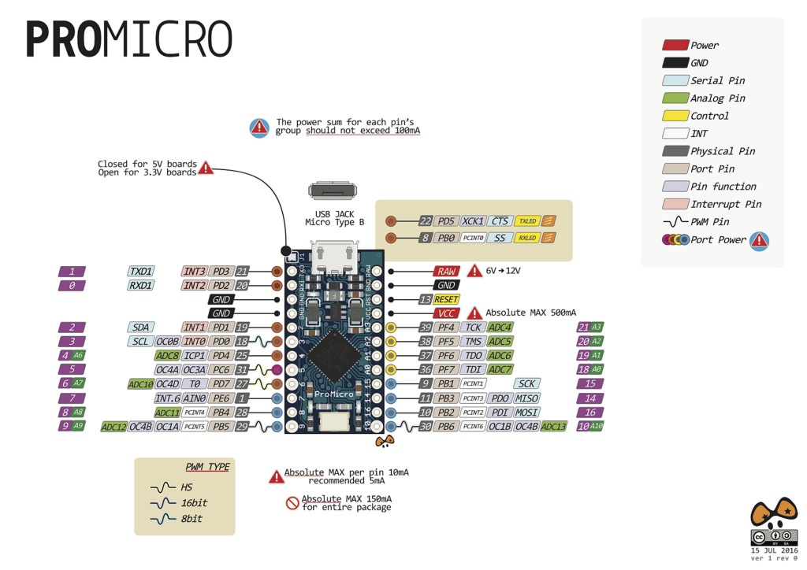
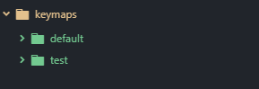

# Macropad workshop

**This is a work in progress**

NOTES:
Will follow ->
Intro and plates > solder > solder and flash test > customize

## The basics - D1


## The casing - D1

Before we start on anything else we should start with the casing. Starting by tackling the plate and getting the switches installed. Popping the switches in is easy and shouldn’t take you too long. Just make sure they all face the same direction.


The plate we’re putting the switches on is 3d printed, so if when you put the switches in they look like the switches do below you will need to clean the hole out. We have sandpaper and x-acto knives for this purpose.



## The wiring - D2 & D3

This part will take some time. Please be patient and take your time. We will have some spare supplies if something breaks, but we don't have enough to replace everyone!

The wiring has 4 parts, soldering the diodes, soldering the wires, soldering the addional stuff, and soldering everything to the microcontroller.


**You may want to use this for your reference while soldering the wires and columns. Keep in mind you are wiring and soldering from the bottom, so the wiring will be flipped horizontally**


### Soldering the diodes





### Soldering the wires







### Soldering the extra stuff

**TODO**

### Soldering the microcontroller



## The firmware - D3
Now that we have the macropad all wired up it’s time for the firmware to make it do neat things!
As mentioned in the beginning we will be using QMK.
First on the computer you will need to get the firmware and the build tools.

### Build Environment
Setting up the build environment differs based on what system you're on. Following the guide [here](https://docs.qmk.fm/#/newbs_getting_started) can get you all set up.
We'll walk through what the guide says for **Windows** below with screenshots.

If you are on another system, you'll have to figure it our yourself at that link, ***but you're probably already used to that I imagine.***

To start, download msys2. That can be found [here](http://www.msys2.org/). You want to click the middle download button (for x86_64).
Allow it to install and open it (just leave the last box checked).
Once it opens paste this command in:

`sh -c "$(curl -fsSL https://raw.githubusercontent.com/StoutIEEE/macropad-workshop/master/setup-qmk.sh)"`

It will ask you to say yes a lot. Just type `y` in response. If it **doesn't** ask you a yes or no question, just press enter. At one point it will ask you for administrative privileges, just say yes. *I promise nothing bad will happen.*

Once the whole process finishes, close the window and relaunch msys2.

Enter this command to get into the source code folder: `cd ~/qmk-firmware/`

Now leave the window as is. We'll come back to it later.

Finally we're going to get a tool to help us flash the firmware. Download [this.](https://github.com/qmk/qmk_toolbox/releases/download/0.0.9/qmk_toolbox.exe)

We're done setting up our built environment. ***Now it's time for the real magic.***


### Building and flashing the firmware

Now that we're ready start playing with our firmware. First lets build against the test layout so we can see if everything is soldered right. Going back to our msys2 terminal type our build command: `make handwired/tennie:test`

It will build. When it finishes run the `qmk_toolbox.exe` you downloaded earlier. You should see a screen like this.

Click the browse button and find the firmware we just built. If you didn't change the install location for msys2 while installing, you should find it at `C:\msys2\home\<username>\qmk_firmware\handwired_tennie_test.hex` where `<username>` is your Windows username (probably Student).

<Im not sure how this goes. Finish this>

Now your firmware should be ready to go. Test your keyboard by opening something you can type into. Your keys should match what's below.
```
         ┌────────┬────────┬────────┐

              1   ,   2    ,    3   ,

    ├────────┼────────┼────────┼────────┼

        4    ,    5   ,   6    ,   7    ,

    ├────────┼────────┼────────┼────────┼

              8   ,   9    ,    0

         └────────┴────────┴────────┘
```
If it doesn't, grab an exec or one of the people helping, something's wrong and we will need to troubleshoot.

If it does, congratulations! Your macropad works! You can move on to wrapping up and making it your own.

## Wrapping up - D3 & D4

Everything is working, but nothing is secured down! We're going to quick change that before we customize the firmware. We need to glue down the reset switch and microcontroller. You should have something like below.


Now, you just need to curl the wires into the frame, and seal it up with the screws!

## Customizing - D4

Now that you have a working keyboard, you can customize it to make it work the way you want. We'll be around to help you, but it's your keyboard so it's impossible to write up a guide for what you'd want! The process, however, can be.

To start open a text editor. I recommend [atom](https://atom.io/) and my example will use it and all directions will assume you are. Augment the directions for your preferred text editor.

To start, open your text editor. If you just installed atom, you will have a few welcome files to close. Open the folder `C:\msys2\home\<username>\qmk_firmware\keyboards\handwired\tennie\keymaps\`. In atom this can be done through `File > Add Project Folder...` and navigating to that folder. Again, if you changed the msys2 install location this will be different.

You should have a dropdown with folders on the left hand of your screen containing these two folders.



At this point you have a decision. **You must choose if you want a single layer or multiple layers.** Having multiple layers will allow you to have more keys bound to a single key and will have more functionality but will be more complicated to set up and remember.

### Single layer

Making a single layer keymap is easy enough, start by copying the `test` folder in the keymaps folder and naming it either your moniker or name.


You'll notice there are 3 files in this folder. We'll start by modifying the `keymap.c` file. Open your file, and turn your attention to the `KEYMAP_kc()` function. This is where you will put the key bindings you want. Basic keys can be put in easily enough. You can find a list of all available basic keys [here.](https://docs.qmk.fm/#/keycodes_basic)

For this example, we'll make our top three buttons song management buttons (skip, play/pause, and previous). Feel free to use whatever keys you would like, I highly recommend looking at the list before continuing.
The `KEYMAP_kc` function makes it so we don't need the `kc_` in front of our keymaps, so we'll omit them. Looking at the [list of basic keycodes](https://docs.qmk.fm/#/keycodes_basic) we can use `KC_MPLY, KC_MPRV` and `KC_MNXT` for play/pause, previous, and next respectivly. You may have noticed that there are also longer names like `KC_MEDIA_NEXT_TRACK` for `KC_MNXT`. Though you could use these longer names, I recommend against it. The shorter 4 character names layer will fit the little ascii version of the macropad, and it will likely be more readable as a result. I won't stop you if you would perfer less archaic variable names!

If you are following my example, after replacing the top 3 buttons, you should have a key map similar to this.


Now, maybe you also want a key that presses a few keys down at once, like `ALT+F4` or `CTRL+ALT+DELETE`. We will go over that next. For reference you may want to look over [the list of functions](https://docs.qmk.fm/#/feature_advanced_keycodes) you can use. There are a lot of interesting features you can use to make the keyboard do what you want. We'll keep it simple and just use the [modifier keys section.](https://docs.qmk.fm/#/feature_advanced_keycodes?id=modifier-keys). Lets make out bottom keys copy, cut, and paste. Looking at the list of modifier key function, we want to use `LALT(kc)`, so we would need `LALT(KC_C)` `LALT(KC_X)` and `KC_V` for copy, cut, and paste respectivly. These will work, but we want to keep our names at 4 characters! To make them like the simple keycodes we need to make a macro. To do that we write something like this `#define KC_ACPY LALT(KC_C)` at the top of our `keymap.c` file where `KC_ACPY` is our ***unique*** keycode name starting with `KC_` and `LATL(KC_C)` is what we want the keycode to be or do (for this example left alt + C). Doing it for all three we get something like below.


We can then use our new keycodes we made in our keymap! We'll put them at the bottom of our macropad. Remember that we omit the `KC_`! The end result should look something like this.


Now you're ready to compile! Skip down to the compile step!

### Multi-layer


### Compiling


## Continue?
You made the macropad and you're happy with it
