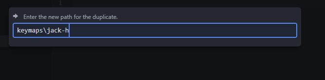

# Single layer

Making a single layer keymap is easy enough, start by copying the `test` folder in the keymaps folder and naming it either your moniker or name.




You'll notice there are 3 files in this folder. We'll start by modifying the `keymap.c` file. Open your file, and turn your attention to the `KEYMAP()` function. This is where you will put the key bindings you want. Basic keys can be put in easily enough. You can find a list of all available basic keys [here.](https://docs.qmk.fm/#/keycodes_basic)

For this example, we'll make our top three buttons song management buttons (skip, play/pause, and previous). Feel free to use whatever keys you would like, I highly recommend looking at the list before continuing. Looking at the [list of basic keycodes](https://docs.qmk.fm/#/keycodes_basic) we can use `KC_MPLY, KC_MPRV` and `KC_MNXT` for play/pause, previous, and next respectivly. You may have noticed that there are also longer names like `KC_MEDIA_NEXT_TRACK` for `KC_MNXT`. Though you could use these longer names, I recommend you don't. The shorter 4 character names layer will fit the little ascii drawing version of the macropad, and it will likely be more readable as a result. I won't stop you if you would prefer less archaic variable names!

If you are following my example, after replacing the top 3 buttons, you should have a key map similar to this.

```
#include QMK_KEYBOARD_H

// Custom keycode definitions, and keycode renames
#define KC_oooo KC_TRNS
#define KC_XXXX KC_NO

// Layer names
#define base  0

const uint16_t PROGMEM keymaps[][MATRIX_ROWS][MATRIX_COLS] = {
  [base] = LAYOUT(
  //         ┌────────┬────────┬────────┐

               KC_MPRV, KC_MPLY, KC_MNXT,

  //    ├────────┼────────┼────────┼────────┼

          KC_4   ,  KC_5  ,  KC_6  ,  KC_7  ,

  //    ├────────┼────────┼────────┼────────┼

                KC_8  ,  KC_9  ,  KC_0

  //         └────────┴────────┴────────┘
  ),
};
```

Now, maybe you also want a key that presses a few keys down at once, like `ALT+F4` or `CTRL+ALT+DELETE`. We will go over that next. For reference you may want to look over [the list of functions](https://docs.qmk.fm/#/feature_advanced_keycodes) you can use. There are a lot of interesting features you can use to make the keyboard do what you want. We'll keep it simple and just use the [modifier keys section.](https://docs.qmk.fm/#/feature_advanced_keycodes?id=modifier-keys). Lets make out bottom keys copy, cut, and paste. Looking at the list of modifier key function, we want to use `LALT(kc)`, so we would need `LALT(KC_C)` `LALT(KC_X)` and `KC_V` for copy, cut, and paste respectivly. These will work, but we want to keep our names at 4 characters! To make them like the simple keycodes we need to make a macro. To do that we write something like this `#define KC_ACPY LALT(KC_C)` at the top of our `keymap.c` file where `KC_ACPY` is our ***unique*** keycode name starting with `KC_` and `LATL(KC_C)` is what we want the keycode to be or do (for this example left alt + C). Doing it for all three we get something like below.

```
#include QMK_KEYBOARD_H

// Custom keycode definitions, and keycode renames
#define KC_oooo KC_TRNS
#define KC_XXXX KC_NO

#define KC_ACPY LALT(KC_C)
#define KC_APST LALT(KC_V)
#define KC_ACUT LALT(KC_X)

```

We can then use our new keycodes we made in our keymap! We'll put them at the bottom of our macropad.  The end result should look something like this.

```
#include QMK_KEYBOARD_H

// Custom keycode definitions, and keycode renames
#define KC_oooo KC_TRNS
#define KC_XXXX KC_NO

#define KC_ACPY LALT(KC_C)
#define KC_APST LALT(KC_V)
#define KC_ACUT LALT(KC_X)

// Layer names
#define base  0

const uint16_t PROGMEM keymaps[][MATRIX_ROWS][MATRIX_COLS] = {
  [base] = LAYOUT(
  //         ┌────────┬────────┬────────┐

               KC_MPRV, KC_MPLY, KC_MNXT,

  //    ├────────┼────────┼────────┼────────┼

            KC_4 ,  KC_5  ,  KC_6  ,  KC_7  ,

  //    ├────────┼────────┼────────┼────────┼

               KC_ACUT, KC_ACPY, KC_APST

  //         └────────┴────────┴────────┘
  ),
};
```

[Now you're ready to compile!](compiling.md)
