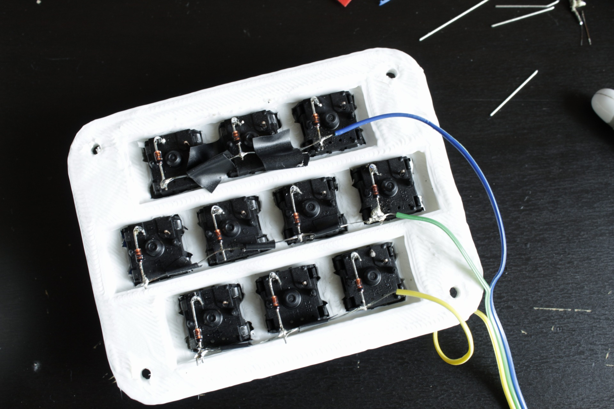
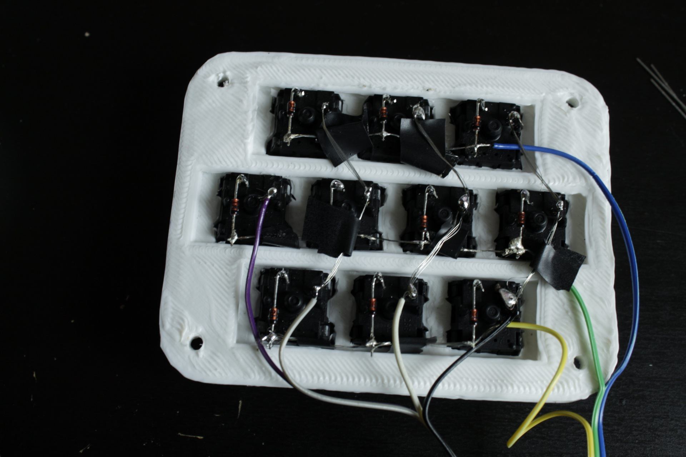
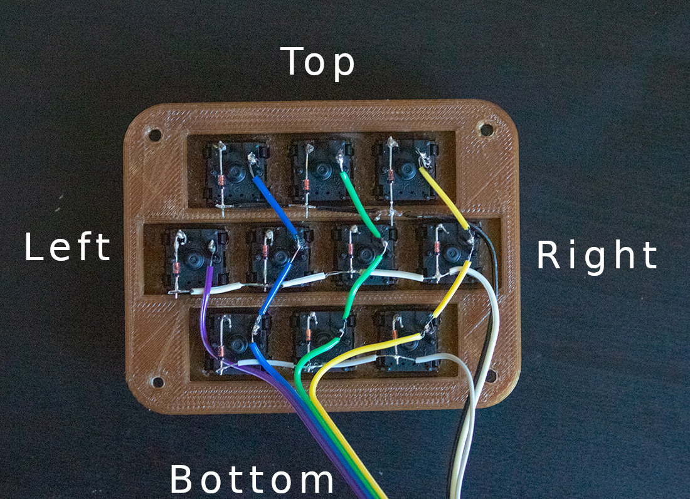
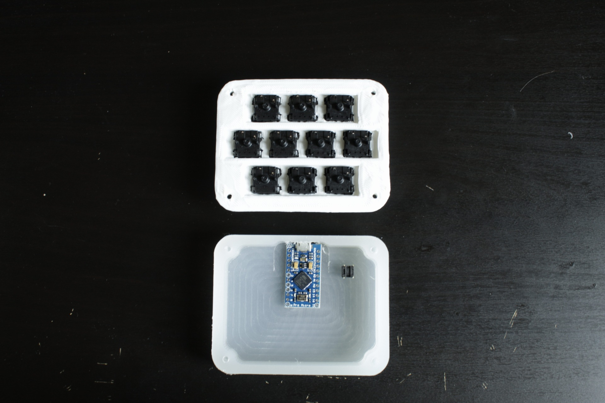
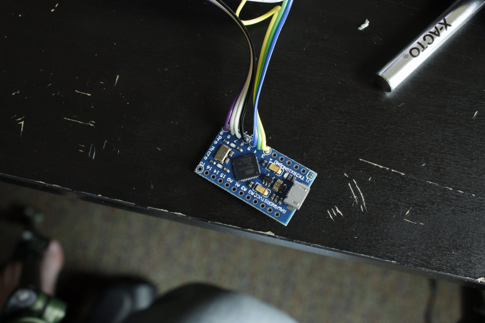
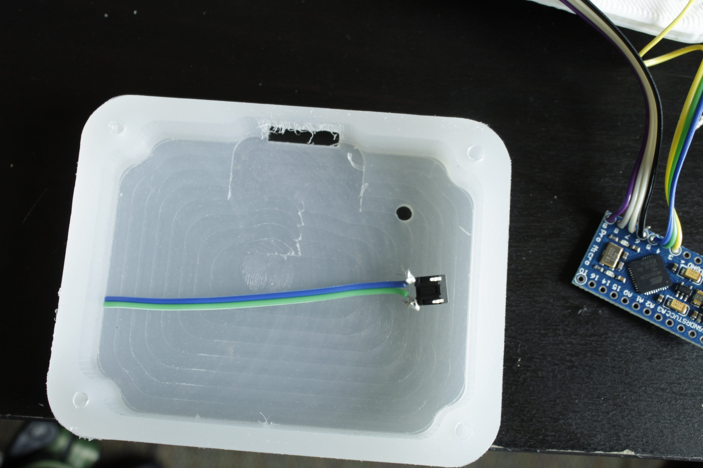
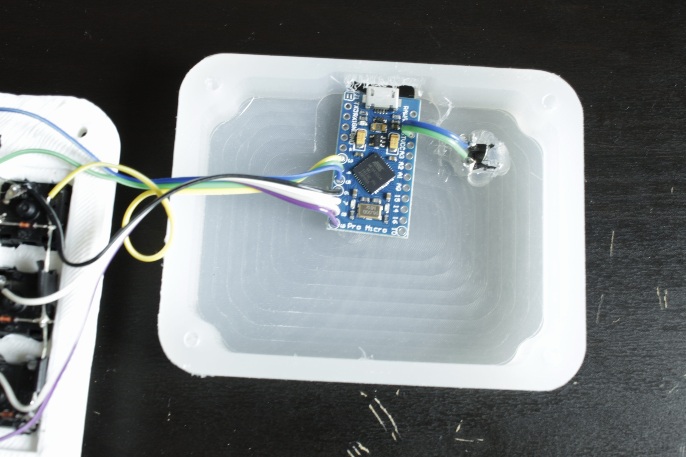

# Soldering

## The start

This part will take some time. Please be patient and take your time. We will have some spare supplies if something breaks, but we don't have enough to replace everyone!

The wiring has 4 parts, soldering the diodes, soldering the wires, soldering the additional stuff, and soldering everything to the microcontroller.


**You may want to use this for your reference while soldering the wires and columns. Keep in mind you are wiring and soldering from the bottom, so the wiring will be flipped horizontally**


### The diodes

Soldering the diodes can be a bit tricky without a lot of extra help. Personally I have found success in bending the diodes like so....

#### **Take special care to make sure that the black part matches up with the picture. Diodes have an orientation and won't work in reverse**


With the diodes bent like that, you can use the extra bent wire part as a stand. You should be able to get it to balance against the plastic numbs on the switches. Work in rows, and use a wire snips to get rid of the extra leg portion. Leave a little space beyond the switch. It shouldn't stray into the next row, **but you also want a lot of room for soldering the wires in the next step**!


When they are all soldered and snipped it's time to move on to soldering the wires!

### The wires

##### I want to start off by noting that I only have one row of diodes in the first picture. You should have a full macropad's worth.
<br>
 To start off, we'll solder the rows. Separate three of the wire colors from the provided wire. Keeping them as together as possible, separate them at the end. This can be done easily with either a wire snip tool or an exact-o knife. You want them to stay together in the middle for wire routing. To take it a step further, you may get a cleaner look if you measure out the length before pulling each off.

 After you have the wire split, you need to strip it. There are two ways to go about this you can either strip it in three to four places, or you can strip it the full length and use electrical tape to cover where wires will overlap. I recommend the electrical tape method for simplicity, though partially stripping it will be cleaner looking.

  The wires will lie along the diodes you just soldered. In the below pictures you may be able to see how this will end up looking. There is a picture showing both methods. After matching up the position of the exposed wire, you will want to tin the wire and diodes. This will make the soldering easier. Then just go through and make sure all the diodes are connected to your wire.


#### The end result should look something like this.




After completing the rows it's time for the columns. **This is where order matters to an extent.** You need to make sure you match what is pictured, because one of the columns is missing two switches. The firmware will need to be changed if it differs from what is shown, and your macropad won't work right away!

Separate 4 more colors off the wire you are given.


This will be a similar process to what you did for the rows, except now we are soldering vertically instead of horizontally and we will be soldering directly to the switch. Solder the wires like shown below.




After you wrap this up you are done with the hardest part! (soldering wise)

### The microcontroller

Again order matters a lot here. Below is a pinout of the microcontroller.


You shouldn't need this unless you did something weird soldering up to this point, but it's a nice reference to have!

If you have the macropad in front of you like it's shown in the pictures, the wires should be soldered to the pins like so...

```
ROWS:
 bottom -> Pin #3 (PD0)
 middle -> Pin #4 (PD4)
 top    -> Pin #5 (PC6)

COLUMNS:
 far right    -> Pin #6 (PD7)
 middle right -> Pin #7 (PE7)
 middle left  -> Pin #8 (PB4)
 far left     -> Pin #9 (PB5)
```

Here's an annotated photo as well to help understand locations.



Solder the wires to the documented pins. If you kept the wires together, putting them in shouldn't be too much trouble.

You will want to chop off the extra wire you don't need so the wires will fold into the base better when we close it up. For measuring the length you need to save, put the plate above the frame, and measure to the microcontroller footprint in the base. It will also be helpful to pop the microcontroller into it's footprint so you can look at pins too.






After the rows and columns are soldered, you have all you ***need*** for your macropad to function. We're going to solder an extra thing to make our life easier.

### The reset switch

Now we need to solder the reset switch so we can program the macropad! We don't *necessarily* need it, but it will make programming it easier. Below is an image of where the reset switch will be glued down. (Button in the hole so we can press it without opening the case)


Using this information, cut a bit of your unused wire colors to size.



Solder them to the RESET and GND pins on the right side of the board. A picture of a finished board is below. These pins are labeled.



After you solder that, you're all done with soldering for this workshop!

[Let's move on to testing your soldering work.](test-wrapup.md)
