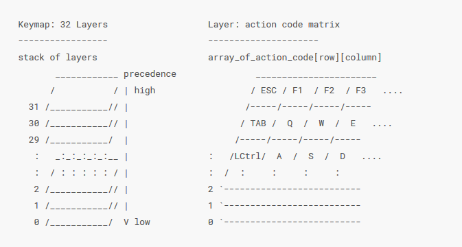

## The basics - D1

Before we get started, I feel like it's important to go over the basics of how keyboards in general work, and how QMK, the firmware we'll be using for our macropad, works.

### On the subject of hardware

Keyboards use microprocessors from either the AVR or ARM families to read the keyswitches and send pressed keys to the computer. A lot of these chips don't have nearly enough inputs to read just one button with each pin. So keyboards utilize a matrix.

In the gif above you can see how this works in a visual way. The microprocessor sends a high signal to each of the columns and checks each row to see if it can see that signal. If it does, that would signal that a key at that position in the matrix is pressed.  

Directly wiring like that brings about a few challenges though. Most notably, there are situations where current could travel where it shouldn't if multiple keys were pressed and can create "ghosting". This can be fixed by inserting diodes in between each button and the input rows, to keep the current from flowing "backwards" and keys from being read when they shouldn't be.

Though the wiring and reading is fundamental to how a keyboard can work, it's useless without something to read! This is where our keyswitches come in. There are quite a few different kinds of keyswitches that can be used. There are really two kinds of switches, purely mechanical switches and membrane switches. Membrane switches are typically associated with cheaper keyboards. There are a few exceptions to this, but we won't go too much into this type since we won't be using it in the workshop. Which leaves us with mechanical switches. There are quite a few different sub-mechanical switch types. The most popular of these switches are the Cherry MX switches and their clones.

They use a spring to hold up a plastic piece with a set resistance of X grams to separate the contacts that would complete the circuit. Various aspects of the resistance the spring provides, travel time, and the sound it makes very based on the color of the switch. For this workshop we are using a cherry clone made by Gateron that are brown switches. These are quiet (they don't make loud clicking), and are fairly low resistance (45g).

There are other really cool types of mechanical switches like ALPS and buckling switches! We won't go over them, but I recommend learning about them if you choose to explore building mechanical keyboards outside of this workshop!

Finally for our hardware, we need keycaps. These can have different side profiles. From the company we ordered our keycaps from, they have 3 different profiles DSA, SA, and DCS. These really just change how the keys contour on the keyboard (as you can see below).

#### DSC

#### DSA

#### SA

We have all of these for the workshop in bins, so feel free to take a look at them in person when you are picking out your keys for your macropad!

### On the subject of software

For this workshop, we are using the open-source keyboard firmware QMK. It has a lot of neat features and convenience scripts to keep the layman out of the lower level C and assembly weeds. Many DIY keyboards use this firmware such as the Plank, or Ergodox keyboards. One of its neat features is its layer system. Below you can see a diagram of it from their wiki:

Each layer can have a different keycode for the same position on the matrix. The firmware searches each layer from highest to lowest until it finds what the key should be given the layer it's on. In the keymap, you can have transparent keys to allow lower layers to pass through as you go up. You can switch between layers in a variety of different ways.

Aside from the layers there are other features that allow you to control RGB leds, "tap dance", play sound, etc. For all features, look at their [reference section](https://docs.qmk.fm/#/) in their wiki!

Alright, with that out of the way, [lets move on to the workshop](prep.md)
