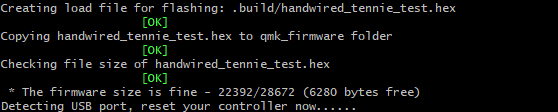
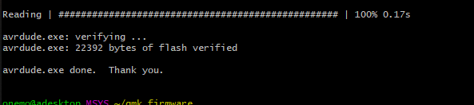
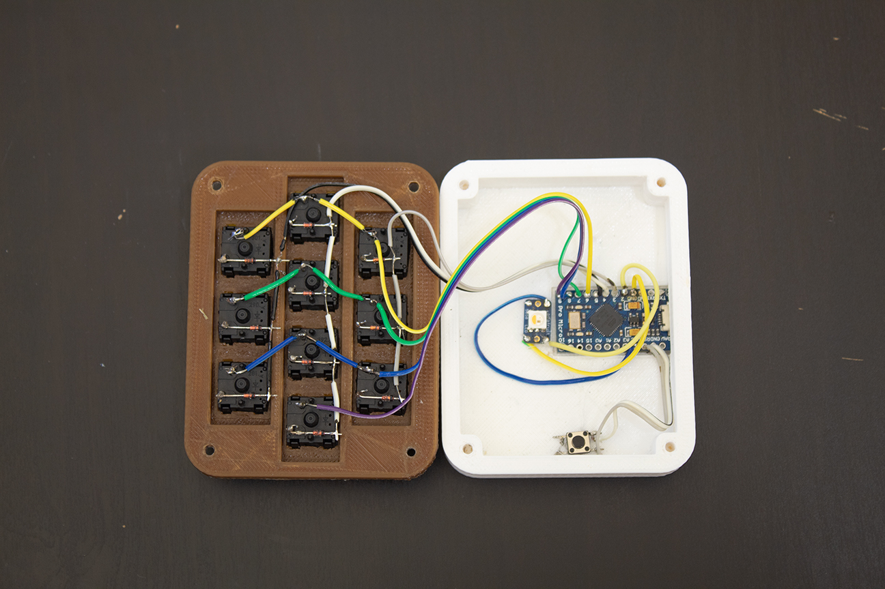

# Testing and wrapping up the building

Now that we're ready start playing with our firmware, we need to first test and make sure everything works. Lets start by building against the test layout so we can see if everything is soldered right. Open your terminal and enter `cd ~/qmk-firmware/` in terminal followed by our build command: `make handwired/tennie:simple-numbpad:avrdude`

It will build. When it finishes it will prompt you like below.



Press the pushbutton we soldered to ground and reset. It should find your keypad and will start flashing it. When it finishes you should see something like this. If you don't call over one of the workshop helpers.



Now your firmware should be ready to go. Test your keyboard by opening something you can type into. Your keys should match what's below.
```
         ┌────────┬────────┬────────┐

              1   ,   2    ,    3   ,

    ├────────┼────────┼────────┼────────┼

        4    ,    5   ,   6    ,   7    ,

    ├────────┼────────┼────────┼────────┼

              8   ,   9    ,    0

         └────────┴────────┴────────┘
```
If it doesn't, grab an exec or one of the people helping, something's wrong and we will need to troubleshoot.

If it does, congratulations! Your macropad works! now we just need to finalize all the hardware and seal it up. We need to glue down the reset switch and microcontroller. You should have something like below.



Now, you just need to curl the wires into the frame, and seal it up with the screws!

[Now we can move on to customizing the keys functionality!](programing.md)
